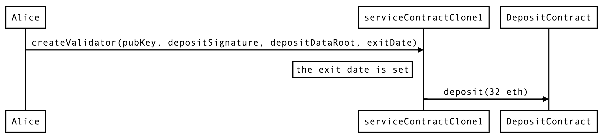
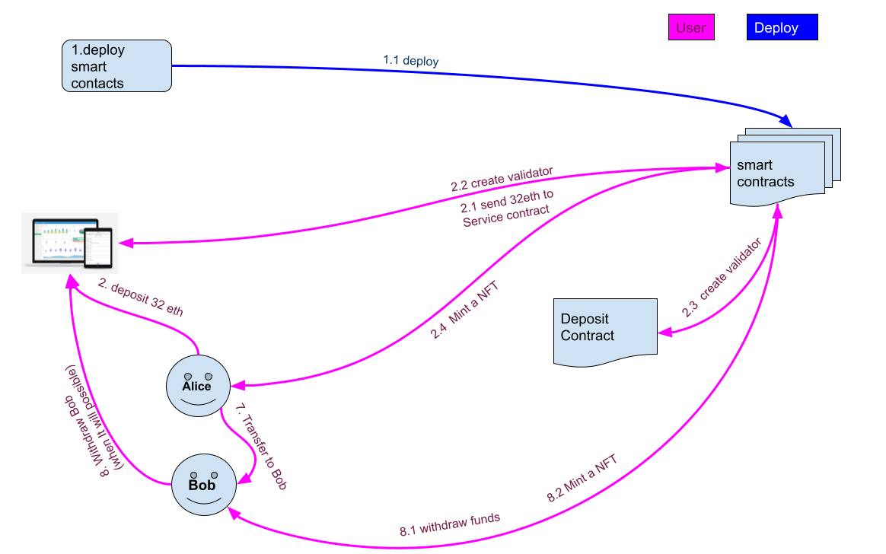

# Sensei Stake ETH 2.0

## Description 

This project is a non-custodial staking platform to Ethereum 2. When you create a validator you receive a NFT refering to your new validator. 


## Useful commands 

```shell
npx hardhat compile (the compile run in all the other calls before test or deploy)
npx hardhat test
npx hardhat deploy --network goerli 

you can use tags to deploy diferent part of the deploy --tags XXX 
```

---
## Deploy details

The deploy was made using [hardhat-deplpy plugin](https://github.com/wighawag/hardhat-deploy "hardhat-deplpy plugin").

Is orgranized in 7 files described in following: 

`00-deploy-deposit-contract.js` (tags : "all", "deposit_contract" )

Deploy the deposit service contract in case we want to test using our deposit contract.

`00-deploy-service-implementation.js`  (tags: "all", "service_implementation")

Use this deploy when you need to use the ServiceContract in verified way and interact in etherscan.

`01-deploy-storage.js` (tags:  "all", "storage", "erc721" )

Deploy the storage contract. This contract stores all the address of all the contract. 

`02-deploy-erc721.js` (tags:  "all", "erc721" )

Deploy the ERC721 contract.

`03-deploy-contract-factory.js` (tags:  "all", "factory" )

Desploy the factory contract. 
Add the factory to ERC20.

`04-deploy-service-contract.js` (tags:  "all", "service-contract" )

This deploy uses some method from  `lib/senseistake-services-contract.mjs`.
- * This deploy create the clone of service contract using a proxy
- * create the deposit data with pubkey, depositSignature, and depositDataRoot to be able for the validator creation. 
- All this information is stored in the backend

`05-set-other-mappings.js` (tags:  "all", "mappings" )

Set all the addresses to storage contract.
Set all the name sof every cotracts address.---

## Step By Step Deploy

- `npx hardhat compile`
- `cp .env.default .env` and update its values
- `npx hardhat deploy --network goerli`

- `npx hardhat deploy --network goerli`

This is integrated with a off-chain backend where we store the information from the deploy to be able to create validator in the process.

---

### Step 1 fund the service contract

The user must call the following method with msg.value and salts. 
```
msg.value : multiple of 32 eth

salt : the salt is generated in the deploy of a service Contract (04) and store in the backend. (Salt bytes:  2c0a756f47cf4394657373ec2ffe52fe841c4b4dcab7c93394ed7240498b3da3)

```
SenseistakeServicesContractFactory.sol —> fundMultipleContracts
During this execution the following acctions happen :
1. For each 32 ethers using one salt to get to the serviceContract.
2. Deposit 32 ethers in each service contracts.


### Step 2 create validator

The user must call the createValidator method from the SenseistakeServicesContract. 

Call the following method to create the validator with parameters from the backend :

```jsx
Method : 
SenseistakeServicesContract —> createValidator(
 bytes calldata validatorPubKey,
 bytes calldata depositSignature,
 bytes32 depositDataRoot,
 uint64 exitDate); 
```

This creates a validator sending all the total supply to the ETH deposit contract. 

The service contract will have no eth after run it and keep it in the deposit address.

--- 

## Notes

### Goerli **DepositContract** address

``0xff50ed3d0ec03aC01D4C79aAd74928BFF48a7b2b``

### Mainnet **DepositContract** address

``0x00000000219ab540356cBB839Cbe05303d7705Fa``

## How does it work?

- The contract starts in a ``NotInitialized`` (0) state in the services contract constructor. After this it transitions to a ``PreDeposit`` (1) state when the ``initialize`` method is called. In this state (only in this state) deposits are allowed from anywhere (multiple of 32 ETH).
- Once the 32 ETH required for the validator to be deployed are fulfilled, the function ``createValidator`` can be called. This function is going to use all the 32 ETH (in the smart contract) to fund the validator. This function can only be executed by the operator (the smart contract deployer, or the address that was assigned if the function ``changeOperatorAddress`` was called).
- Once the function ``createValidator`` is called, the smart contracts transitions to the state ``PostDeposit``(2). In this state no withdrawals can be made until the eth2 will reach the phase update that is allow to do it. 
- Once the validator is decided to be stopped , the deposit is able to be withdrawn (we'll need to see how things are handled after the merge). After this, the validator funds go to the services smart contract address. Then the function ``endOperatorServices`` can be called, which triggers a change of state in the smart contract, from ``PostDeposit`` to ``Withdrawn``. Only in this state, clients (and the operator) are able to withdraw their initial investments (and/or revenues) (this must be done by operator after exit date or by the depositor after exit date + MAX_SECONDS_IN_EXIT_QUEUE).
- Clients are the ones that are able to use the ``withdraw`` or ``withdrawAll`` to withdraw their deposit. What they can withdraw are their initial deposit plus earnings minus operator fees.
- If the operator wants to withdraw its earnings (collected fees of clients), it can do it calling the function ``operatorClaim``.


## Sequence diagrams 

### Deposit 32 eth


### Create a validator




## Complete diagram of all process

